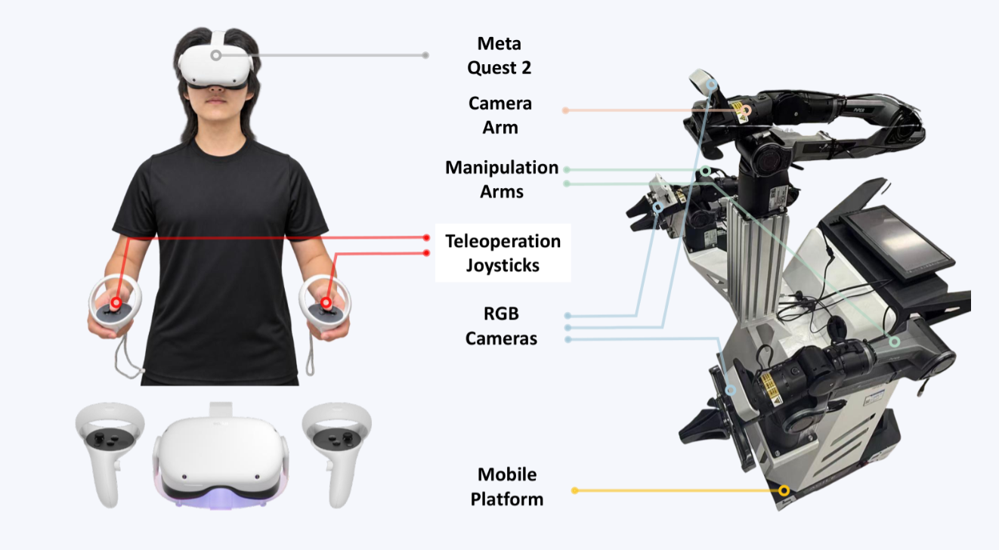

<h1 align="center">ActiveScale: Scaling Active Perception for Robots<br>across Model, Data, and Hardware</h1>

<p align="center">
  <a href="https://arxiv.org/abs/2609.18514"></a>
  <a href="https://active-scale.github.io/"></a>
  <a href="https://youtu.be/Iya0bSZ8Dko"></a>
  <a href="https://huggingface.co/davidzhou302/ActiveScale"></a>
  <a href="https://modelscope.cn/datasets/ShuaiZhou302/ActiveScale"></a>
</p>

<p align="center">
  If you encounter any problems, please <a href="https://github.com/ShuaiZhou302/ActiveScale/issues">open an issue</a>. We will respond as soon as possible.
</p>

<p align="center">
  <a href="https://youtu.be/Iya0bSZ8Dko">
    
  </a>
</p>

<p align="center">
  <a href="https://active-scale.github.io/">
    
  </a>
</p>

Active perception allows a robot to deliberately change its viewpoint to
reveal task-relevant information that a fixed camera may miss, such as objects
hidden by clutter or inside a container. **ActiveScale presents a scalable way
to study active perception for robot manipulation across model, data, and
hardware.** It augments a vision-language-action model with historical video
observations and explicit camera-pose supervision, adapts temporal reasoning
through human-robot mid-training, and introduces the Active-perception
Mobile-manipulation Platform (AMP) for single-operator collection of
coordinated viewpoint and manipulation demonstrations.

## Installation

```bash
git clone https://github.com/ShuaiZhou302/ActiveScale.git
cd ActiveScale

conda create -n activescale python=3.11 -y
conda activate activescale

python -m pip install --upgrade pip
python -m pip install -e packages/openpi-client
python -m pip install torch==2.7.1
python -m pip install "https://github.com/huggingface/lerobot/archive/0cf864870cf29f4738d3ade893e6fd13fbd7cdb5.zip"
python -m pip install ml-dtypes==0.4.1 tensorstore==0.1.74
python -m pip install -e .
python scripts/install_transformers_patch.py
```

## Data

The expected human and robot sample formats are documented in
[docs/DATA_FORMAT.md](docs/DATA_FORMAT.md). Configure local dataset and cache
paths in `configs/activescale.env`:

```bash
cp configs/activescale.example.env configs/activescale.env
```

## Training

```bash
bash scripts/train_activescale.sh smoke
bash scripts/train_activescale.sh midtrain <steps> [save_interval]
bash scripts/train_activescale.sh posttrain <steps> [save_interval]
```

Training options are documented in [docs/TRAINING.md](docs/TRAINING.md).

## Inference

The remote policy server and client are included in
[scripts/serve_policy.py](scripts/serve_policy.py) and
[packages/openpi-client](packages/openpi-client). Run either entry point with
`--help` for its checkpoint and connection options.

The training-free Real-Time Chunking implementation is included in
[src/openpi/models_pytorch/rtc.py](src/openpi/models_pytorch/rtc.py) and is
integrated with the PyTorch policy path.

## Teleoperation

<p align="center">
  
</p>

AMP augments the AgileX Cobot Magic bimanual platform with a third 6-DoF Piper
arm carrying the active front camera. The Quest 2 interface allows one operator
to control the camera viewpoint, both manipulation arms, and the mobile base.
Code, setup instructions, mechanical notes, and the CAD release layout are
included in [`teleoperation/quest2`](teleoperation/quest2).

## License

Code is released under Apache-2.0. Model weights derived from Gemma remain
subject to the Gemma terms.

## Acknowledgements

Part of the source code is based on
[openpi](https://github.com/Physical-Intelligence/openpi).

## Citation

```bibtex
@article{zhou2026activescale,
  title   = {ActiveScale: Scaling Active Perception for Robots
             across Model, Data, and Hardware},
  author  = {Zhou, Shuai and Pang, Kaisheng and Song, Wenxuan
             and Zhang, Wenjie and Zheng, Xinhu and Li, Haoang},
  journal = {arXiv preprint arXiv:2609.18514},
  year    = {2026}
}
```
