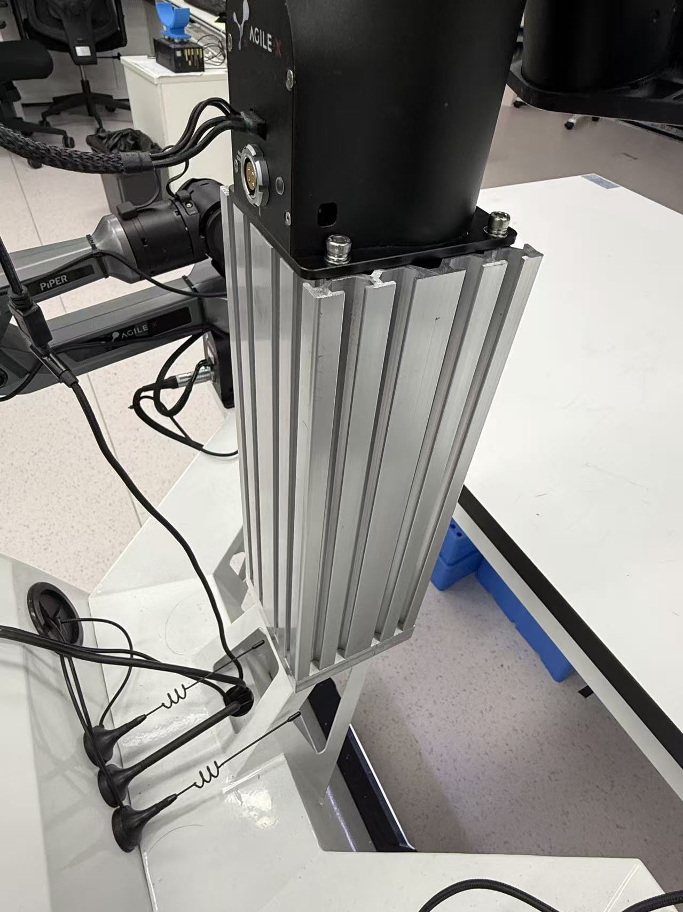
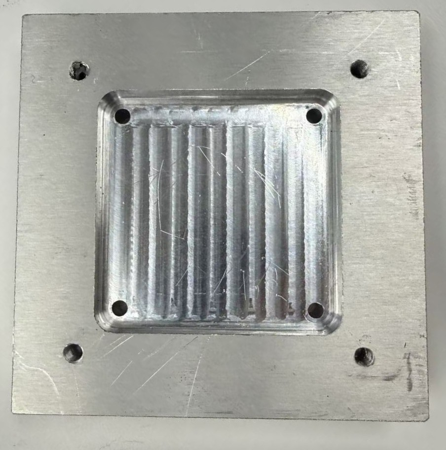

# Quest 2 teleoperation

This directory contains the Quest 2 teleoperation stack used for Piper data
collection. It supports WebXR and OpenVR input, three arm targets, grippers,
an optional mobile base, and three camera streams.

<p align="center">
  
</p>

## Robot hardware

The Active-perception Mobile-manipulation Platform (AMP) is built on an AgileX
Cobot Magic mobile bimanual platform. Two 6-DoF Piper arms perform manipulation
and carry wrist RGB cameras. A third 6-DoF Piper arm is mounted on the center
tower and carries the active front RGB camera. The Quest 2 headset and
controllers provide the operator input, so one person can coordinate the
viewpoint, both manipulation arms, and the mobile base.

The center tower in our build uses a 100 x 100 mm European-standard industrial
aluminum extrusion between the Cobot Magic chassis and the camera arm. The
upper and lower mounting patterns must be machined according to the released
drawings. A custom aluminum adapter sits between the extrusion and the chassis.
In the released build:

- the four upper mounting holes are tapped with an M5 coarse thread;
- the mating holes on both machined aluminum adapters use an M5 coarse thread;
- the 100 x 100 mm extrusion accepts M8 hardware, so eight M8-to-M5 threaded
  reducer sleeves are used at the adapter interfaces.

The released [STEP model](hardware/cad/ConnectPad.step) describes the custom
adapter. The photos below show the center-tower assembly and machined adapter.
Verify all dimensions, thread engagement, clearance, and structural loading
against the exact robot revision before machining or energizing the system.

<p align="center">
  
</p>

<p align="center"><strong>Center-tower assembly.</strong> The 100 x 100 mm extrusion connects the mobile chassis to the third Piper camera arm.</p>

<p align="center">
  
</p>

<p align="center"><strong>Machined chassis adapter.</strong> The plate mates the extrusion to the Cobot Magic base using the released hole pattern.</p>

## Requirements

- a Quest 2 and a Windows PC on the same network
- ROS with the Piper drivers on the robot computer
- Python packages: `numpy`, `websockets`, `Pillow`, `casadi`, and `pinocchio`
- robot-specific URDF, ROS topics, joint limits, and camera topics

## Robot side

Start the Piper ROS drivers first. Then set the URDF and run the pose server:

```bash
export PIPER_URDF=/path/to/piper.urdf
python teleoperation/quest2/quest_server.py
```

Run the camera stream in a second terminal:

```bash
python teleoperation/quest2/camera_streamer.py \
  --left_topic /camera_l/color/image_raw \
  --mid_topic /camera_f/color/image_raw \
  --right_topic /camera_r/color/image_raw
```

All ROS topics, URDF paths, speed limits, watchdog delays, gripper ranges, and
ports are command-line arguments. Run either script with `--help` to list them.

## Windows and Quest side

1. Add an SSH config entry named `robot` for the robot computer.
2. Run `scripts/start_tunnel.ps1` in PowerShell.
3. Install `websockets` and `numpy` in the Windows Python environment.
4. Generate `webxr/cert.pem` and `webxr/key.pem` with `mkcert` for the Windows
   LAN address.
5. Run `python webxr/webxr_server.py`.
6. Open `https://<windows-lan-ip>:8443` in the Quest browser and enter VR.

The OpenVR fallback uses `openvr_reader.py` and `quest_client.py`.

## Safety

The robot-side server implements clutching, stale-input freeze, ramp-home, and
base-stop behavior. These software checks do not replace a physical emergency
stop. Verify frames and limits without motor power, commission at reduced
speed, and keep the workspace clear.
